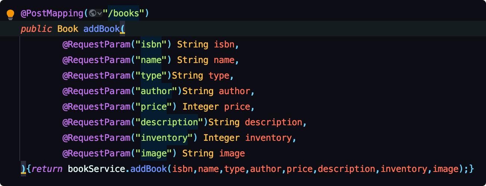

# README

## 全文搜索

使用Lucene

添加了IndexFiles 和SearchFiles，并且每次后端重启的时候就生成新的indexFile, 传入前端的query请求，得到List<Book>的结果

## 实现效果

## webservice

采用restfulWebService, 因为只有查询，所以就用getMapping

这里用同一个URL，但是带不同的参数，实现了接口是对数据而不是操作定义的restful的web service

针对不同的操作使用不同的方法（Post,get,...)œ